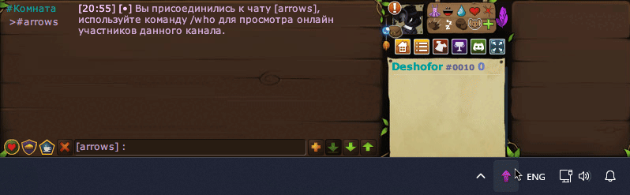

# TFM Utils

A handy collection of small utilities for [Transformice](https://www.transformice.com/). Built to make in-game tasks simpler, faster, and more comfortable.

---
## WASD to Arrows

Converts WASD or arrow-key presses into arrow symbols.
### Features:
* Toggle ON/OFF with F3
* Quickly disable with ESC
* Turns off automatically after 1 minute
* WASD or arrow-key input mode
* Combo mode (Duplicate arrows will be merged)
* Multiple interface languages
* Runs from the system tray
* No installation required when using the executable

### [Download](https://github.com/2Desh/TFM-Utils/releases/latest)

---

## Running from Source
To run this, you'll need Windows and Python 3.X.

1. Clone the repository.
2. Install dependencies: `pip install -r requirements.txt`
3. Run the utility, for example: `python arrows.pyw`

More utilities will be added to this collection over time.

